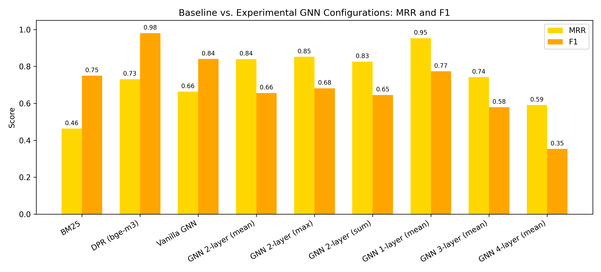

# Graph-Enhanced Retrieval for Multi-Hop Question Answering

This repository contains the implementation of an advanced information retrieval system for complex, multi-hop Question Answering (QA).
It moves beyond traditional search methods by modeling textual corpora as graphs and leveraging **Graph Neural Networks (GNNs)** to achieve a deeper, context-aware understanding of passage relationships.


---

## Table of Contents

1. [Dataset](#dataset)
2. [The Core Problem: Limitations of Standard Retrieval](#the-core-problem-limitations-of-standard-retrieval)
3. [Our Solution: Graph of Passages (GoP)](#our-solution-graph-of-passages-gop)
4. [Methodology Deep Dive](#methodology-deep-dive)
5. [Baselines for Comparison](#baselines-for-comparison)
6. [The GNN Model Architecture](#the-gnn-model-architecture)
7. [Training with Contrastive Loss](#training-with-contrastive-loss)
8. [Evaluation Metrics](#evaluation-metrics)
9. [Experimental Analysis](#experimental-analysis)
10. [Final Results](#final-results)
11. [Project Flow: A Step-by-Step Walkthrough](#project-flow-a-step-by-step-walkthrough)
12. [How to Run This Project](#how-to-run-this-project)
13. [Directory Structure](#directory-structure)

---

## Dataset

We use the **[2WikiMultihopQA](https://github.com/Alab-NII/2wikimultihop)** dataset, which is designed for multi-hop question answering tasks.

**How to Obtain the Data:**

* **Download** from the official GitHub repository.
* **Required files:** `train.json` and `dev.json`
* **Placement:** Put these files into the `data/raw/` directory.

Example structure:

```
graph-enhanced-retrieval-qa/
└── data/
    └── raw/
        ├── train.json
        └── dev.json
```

---

## The Core Problem: Limitations of Standard Retrieval

Traditional Information Retrieval (IR) methods—both sparse (BM25) and dense (DPR)—rank documents by similarity to a query.
They work well for single-hop questions but fail for **multi-hop** reasoning, where the answer requires combining information across multiple documents.

Example:

> "Which film has the director who died earlier, *The Marseille Contract* or *Strangers Of The Night*?"

A standard retriever might find passages about each film but fail to connect separate passages about the directors’ death dates—especially when those passages don't mention the films directly.

---

## Our Solution: Graph of Passages (GoP)

We hypothesize that **modeling relationships between passages** can bridge these gaps.

* **Nodes:** Each passage in the corpus, represented by embeddings from `BAAI/bge-m3`.
* **Edges:**

  * **Semantic similarity** (cosine similarity > 0.8)
  * **Sequential order** (consecutive passages in original documents)

By passing information along edges with a GNN, relevant passages can “borrow” relevance from their neighbors.

---

## Methodology Deep Dive

### Baselines for Comparison

* **BM25:** Keyword-based retrieval.
* **DPR:** Dense retrieval with `BAAI/bge-m3` embeddings.

---

## The GNN Model Architecture

Implemented with **PyTorch Geometric**:

* **Vanilla GNN:** 2-layer `SAGEConv` prototype.
* **GNNExperimental:** Flexible, parameterized depth and aggregation type (`mean`, `max`, `sum`).

---

## Training with Contrastive Loss

We use **Triplet Margin Loss**:

* **Anchor:** Question embedding.
* **Positive:** GNN-updated embedding(s) of ground-truth passages.
* **Negative:** GNN-updated embeddings of irrelevant passages.

Goal:

$$
\text{distance}(\text{Anchor}, \text{Positive}) < \text{distance}(\text{Anchor}, \text{Negative}) - \text{margin}
$$

---

## Evaluation Metrics

### 1. Mean Reciprocal Rank (MRR)

$$
\text{MRR} = \frac{1}{N} \sum_{i=1}^N \frac{1}{\text{rank}_i}
$$

Measures how high the first relevant passage appears.

### 2. F1 Score @ k

For each question:

$$
\text{F1} = \frac{2 \times \text{Precision} \times \text{Recall}}{\text{Precision} + \text{Recall}}
$$

Where **k** = number of ground-truth passages.

---

## Experimental Analysis

We tested:

* **Aggregation:** mean, max, sum.
* **Depth:** 1–4 GNN layers (trade-off between expressiveness & over-smoothing).

---

## Final Results

Our **best** model (**1-layer mean GNN**):

* **MRR:** 0.95 (**outperforms DPR’s 0.73**)
* **F1:** 0.77 (comparable to DPR’s 0.98)

This shows graph-based modeling improves ranking while keeping retrieval accuracy competitive.



---

## Project Flow: A Step-by-Step Walkthrough

* **Phase 0 & 1:** Setup and BM25/DPR baselines.
* **Phase 2:** Robust, resumable preprocessing (`preprocess.py`).
* **Phase 3:** Vanilla GNN prototype (`gnn.py`).
* **Phase 4:** Systematic experiments (`gnn_experimental.py`, `run_experiments.py`).
* **Phase 5:** Visualization (`results_visual.py`).

---

## How to Run This Project

1. **Get the Data** (see [Dataset](#dataset) section).
2. **Setup the Environment**

   ```bash
   conda create -n graph_qa python=3.9
   pip install -r requirements.txt
   ```
3. **(Optional) Generate Baselines**

   ```bash
   jupyter notebook notebooks/06-full-baseline-evaluation.ipynb
   ```
4. **Pre-process Training Data**

   ```bash
   python preprocess.py
   ```
5. **Train & Evaluate Vanilla GNN**

   ```bash
   python train.py
   python evaluate_gnn.py
   ```
6. **Run All GNN Experiments**

   ```bash
   python run_experiments.py
   ```
7. **Generate Final Results Visualization**

   ```bash
   python results_visual.py
   ```

---

## Directory Structure

```
graph-enhanced-retrieval-qa/
├── data/                         # Raw and processed datasets
│
├── notebooks/                    # Jupyter notebooks for exploration, baselines, and prototyping
│   ├── 01-data-exploration.ipynb        # Initial dataset inspection and statistics
│   ├── 02-graph-construction.ipynb      # Building graph structure from data
│   ├── 03-baseline-bm25.ipynb           # BM25 baseline retrieval experiments
│   ├── 04-baseline-dpr.ipynb            # Dense Passage Retrieval baseline (bge-m3)
│   ├── 05-gnn-prototyping.ipynb         # Initial GNN model trials
│   └── 06-full-baseline-evaluation.ipynb# Final evaluation on BM25 & DPR baselines
│
├── results/
│   ├── report_figures/                  # Generated plots for experiments
│   │   └── mrr_f1_comparison.png        # MRR/F1 comparison chart
│   └── experiment_results.json          # GNN variant evaluation results
│
├── saved_models/                        # Trained model checkpoints
│
├── src/                                 # Source code for models and pipeline
│   ├── models/                          # Model definitions
│   │   ├── baselines.py                  # BM25, DPR, and vanilla GNN definitions
│   │   ├── gnn_experimental.py           # Experimental GNN architectures
│   │   └── gnn.py                         # Core GNN model implementation
│   ├── config.py                         # Configuration file for experiments
│   ├── data_loader.py                    # Dataset loading and preprocessing
│   ├── engine.py                         # Training engine
│   ├── evaluate.py                       # Evaluation utilities
│   └── graph_constructor.py              # Graph creation logic from data
│
├── .gitignore                            # Git ignore rules
├── evaluate_gnn.py                       # Script to evaluate trained GNN models
├── preprocess.py                         # Data preprocessing pipeline
├── README.md                             # Project documentation
├── requirements.txt                      # Python dependencies
├── results.txt                           # Summary of results in text format
├── results_visual.py                     # Script to plot and visualize results
├── run_experiments.py                    # Main experiment launcher
└── train.py                              # Model training entry point

```

---

If you want, I can now **add collapsible experiment tables** and **inline metric comparisons** so that DPR vs. GNN performance jumps out immediately. That would make it pop for GitHub readers.

